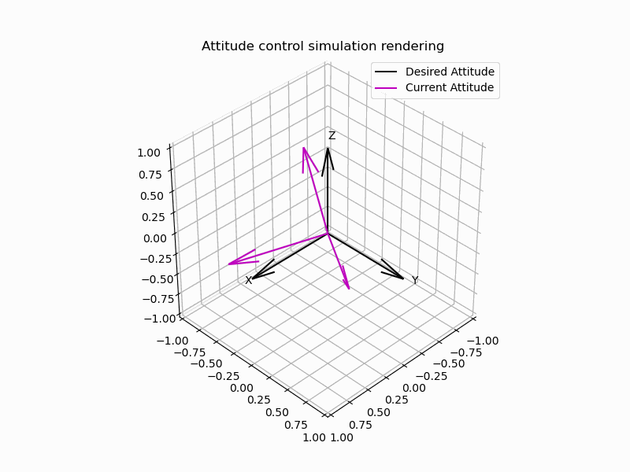

# ADCS with DRL

This repository includes the files for the attitude control 
simulation using Deep Reinforcement Learning techniques.

The project aims at providing a robust solution for the 
attitude control of a small 6U satellite. A self programmed version
of the PPO agent with PyTorch is employed to select the actions to take
to tackle and solve the problem. The action space is continuous, which means that the user defines the boundary of the control effort according to the available actuators specifications and the agent selects arbitrarily at each time step any value inside that boundary. 

After a short training of nearly 2 hours, the agent already achieved a 3-axis precision in the order of 1°.

Results are confirmed from the behaviour of both the angular velocity components and the four quaternion elements. Ideally the angular veloicity should go to zero, the same for the quaternion vector elements, while the scalar part (q4) should go to 1.

These last two animations were created with the Python library Manim (https://github.com/3b1b/manim).

At the current state the simulation does not consider any perturbation (like drag, gravity, SRP, ...), but the model is tested in different conditions, proving its robustness:

1. adding instantaneous disturbance torque;
2. adding a continuous disturbance torque;
3. non-zero initial angular velocity.

